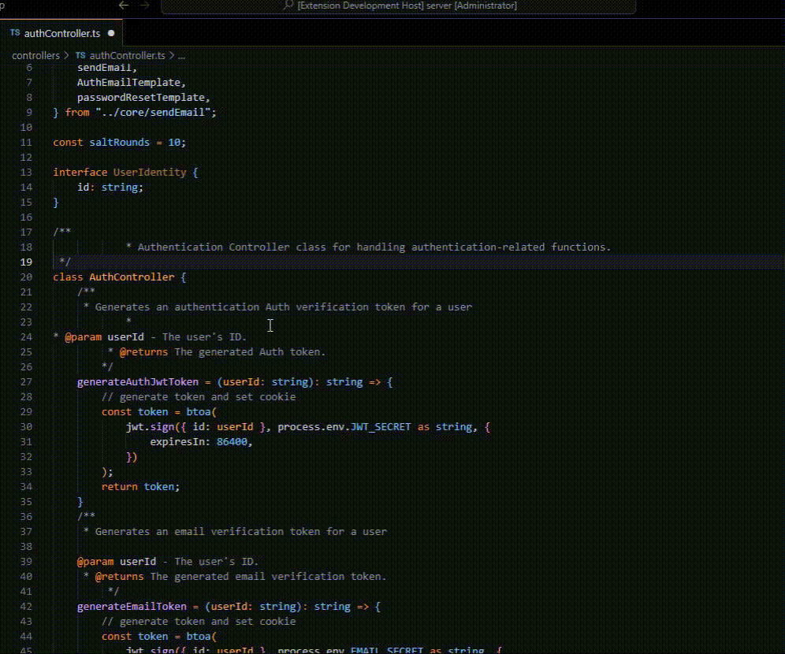

# Format JSDoc Comments Extension

**Format JSDoc Comments** is a Visual Studio Code extension that simplifies the task of formatting JSDoc comments within your codebase. It automates the process of aligning the asterisk (\*) characters in multiline JSDoc comments to adhere to JSDoc formatting conventions.

## Features

## Installation

1. Open Visual Studio Code.
2. Go to the Extensions view by clicking on the square icon in the sidebar.
3. Search for "Format JSDoc Comments" in the search bar.
4. Click the "Install" button for the extension.

## Usage

1. Open a JavaScript or TypeScript file in Visual Studio Code.
2. Select the JSDoc comment block that you want to format.
3. Right-click on the selected block and choose "Format JSDoc Comments: format" from the context menu.
4. The selected JSDoc comment block will be automatically formatted according to JSDoc conventions.

## Requirements

- Visual Studio Code version 1.82.0 or higher.

## Extension Settings

This extension does not have any configurable settings at the moment.

## How to Contribute

If you encounter any issues or have suggestions for improvements, please feel free to contribute to this project on [GitHub](https://github.com/I3NLi/formatJsdocComments). We welcome your contributions!

## Known Issues

There are no known issues with this extension. If you encounter any problems or have suggestions for improvements, please [file an issue](https://github.com/I3NLi/formatJsdocComments/issues).

## Release Notes

Check the [changelog](CHANGELOG.md) for information about recent updates and releases.

## License

This extension is licensed under the [MIT License](LICENSE).

## Author

- Boning Li
- [GitHub](https://github.com/I3NLi)

---

If you find this extension helpful, please consider [supporting the author](https://github.com/I3NLi) by starring the repository or [making a donation](https://paypal.me/your-paypal-account). Your support is greatly appreciated!

Happy coding!
